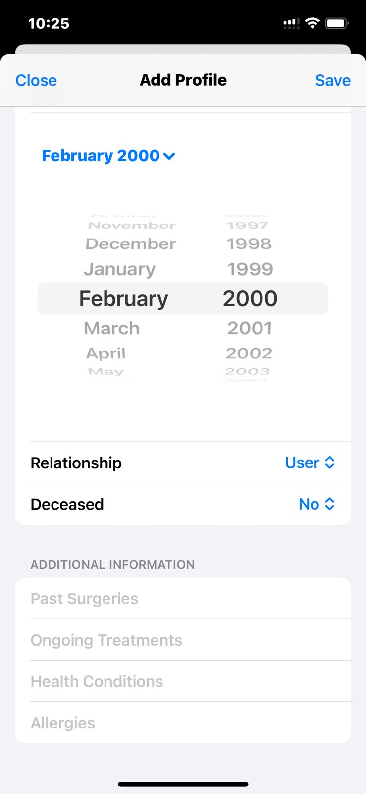

# HestiaHub: Nurturing Your Family's Well-being
 Mobile Application for Health Document Management

## Screenshots:

### Project Overview

**Title:** HestiaHub

**Team Members:**
- Mira Saleh (ms13205@nyu.edu)
- Kevin Chu (kc4624@nyu.edu)
- Amine Tabsissi (at5022@nyu.edu)
- Claudio Falcioni (cf2600@nyu.edu)

### Project Description:

"HestiaHub" is a mobile application that aims to develop a comprehensive, centralized platform that serves both as a family health management system and a personal health record. It is designed to facilitate families and individuals in managing health records, tracking vaccinations, and scheduling preventive health check-ups. By integrating these functionalities into a single user-friendly dashboard, HestiaHub seeks to enhance the overall health management experience, making it more accessible, efficient, and personalized. Its comprehensive and worldwide capabilities are designed to support even the most itinerant families in monitoring their health and well-being.

### Business Goals
**<u>Mission</u>:**  
To facilitate storing, accessing, and tracking families’ health information and ease follow-up actions as a household.    
**<u>Goals</u>:**  
- **Enhance Health Management Efficiency:**  
  Streamline the process of managing health records and appointments for families, reducing the time and effort required to maintain up-to-date health information.
  
- **Improve Preventive Healthcare:**  
  Increase adherence to vaccination schedules and preventive check-ups through timely reminders, contributing to better health outcomes for users.
  
- **Facilitate Access to Health Information:**  
  Provide users with easy access to their health records and health-related information, improving decision-making in health matters and facilitating the sharing of said info with healthcare   providers regardless of cultural differences such as language and units.

- **Data Security and Privacy:**  
  SEnsure the secure storage and management of personal health information, building trust and compliance with data protection regulations.

### Main Features
**<u>Primary (derived from business goals)</u>:**
- **Intuitive User Interface:**  
  Craft an accessible and intuitive dashboard that centralizes all health-related information, enabling users to effortlessly navigate through various functionalities such as family member profiles, vaccination schedules, and health check-up reminders.

- **Family Member Profiles:**  
  This allows users to create and manage profiles for each family member, including health records, medical history, and personal information.

- **Vaccination Schedule Reminders:**  
  Automatically generate suggested vaccination schedules for each family member, which depend on user age and WHO requirements, with automatic reminders for upcoming vaccinations.
  
- **Health Check-up Scheduler:**  
  Enable users to schedule and track health check-ups, with reminders and calendar integration.

- **Medical Document Translation:**  
  Users can upload medical documents directly to the app, and the integrated translation feature will provide translated versions, facilitating a better understanding of healthcare information for individuals and families with diverse linguistic backgrounds.
  
- **Effortless Document Upload:**  
  Facilitate a simple and efficient document upload feature, allowing users to quickly add medical documents to their profiles. This feature should support a wide range of formats, ensuring that users can easily manage and organize their health records.

**<u>Possible Extension</u>:**
- **Seamless Login Mechanism:**  
  Implement a streamlined login process that ensures secure and easy access to user accounts, enhancing user experience and safeguarding personal and medical information.
  
- **QR Code Generation for Simplified Sharing:**  
  Introduce a feature to generate a unique QR code for each user or family profile. This will enable users to share their health information with healthcare providers or family members securely and conveniently, promoting better communication and coordination of care.
  
- **Integration with Health Providers:**  
  A potential functionality to integrate with healthcare provider systems, allowing for seamless sharing and updating of health records and facilitating communication between users and their healthcare professionals.

- **Pop-ups for Health Campaigns and Events:**  
  Based on local hospitals and government initiatives, the user will be prompted with notifications about activities such as blood drives or awareness campaigns

### Scope
**<u>Within Scope</u>:**
  - Test results
  - Treatments and prescriptions
  - Insurance claims and forms
  - Family histories and past medical interventions

**<u>Within Extended Scope</u>:**
  - Integration with external healthcare provider systems for real-time data exchange
  - Sharing events and activities based on hospital or government initiatives

**<u>Out of Scope</u>:**
  - Tracking diet and habits
  - Physical health monitoring devices or wearables integration.
  - In-depth medical diagnostics or medical advice; the platform serves as a record-keeping and coordination tool rather than a substitute for professional medical consultation.
  - Child-friendly mode, since children will not be using this system

**<u>System Boundaries</u>:**  
The system is bounded by user-entered data and scheduled reminders based on this data, without direct medical intervention.  

### Stakeholders

- **Family members:**  
  Primary users of the platform, will be reading and editing information.
  
- **Healthcare Providers:**  
  Potential readers of patient health records with consent, for better patient care.

- **Insurance Companies:**  
  The data stored in the records may be insurance forms/claims, which are read and provided by the insurers.

- **Developers:**  
  Responsible for developing, deploying, and maintaining the system.

- **IT Staff:**  
  Responsible for planning, coordinating, and executing the project. Ensure that project goals align with business objectives and stakeholder expectations.

- **UX Designers:**  
  Design the user interface and overall user experience. Ensure that the platform is intuitive, user-friendly, and aligns with user needs.
  
- **QA Testers:**  
  Conduct testing to ensure the platform meets quality standards. Identify and report bugs or issues for resolution.

- **Government Health Departments:**  
  Monitor and regulate healthcare data management practices. Ensure that the platform adheres to national health standards.

- **Competitors:**  
  MyChart, Carezone, Medrec, FamGenix Family Health History

### Constraints
- **Limited Budget:**  
  The lack of budget may restrict the extent of features and technologies that can be implemented (database, AI APIs, servers, domains, etc…)
  
- **Project Timeline:**  
  The project timeline may limit the development phases, requiring prioritization of features.

- **Technical Limitations:**  
  The choice of app development tools, cloud platforms, and storage must balance functionality, cost, and ease of use.

- **Data Standards Compliance:**  
  Adherence to healthcare data protection standards (e.g., HIPAA in the U.S.) and accurate medical information (e.g., WHO standards) are mandatory, influencing system design and data handling.

### Risks

- **Data Security Breaches & User Privacy Violations:**  
  Risk of unauthorized access to personal health information and potential for misuse of personal data.Mitigation through the use of reliable data hosting tools. 
  
- **Project Overruns:**  
  time overruns due to unforeseen complexities. Managed by implementing agile project management practices that we will learn in class.

- **Technology Adaptation Challenges:**  
  Users may find it difficult to adapt to the new system and may stick with non-digital means. Managed by incorporating user feedback into continuous improvement and including ways to incentivize the shift, such as user-friendly design, comprehensive user guides, and customer support methods.
  
- **Integration with Existing Healthcare Systems:**  
  Difficulties in integrating with external healthcare providers' systems. Managed by using standardized APIs, engaging with stakeholders early in the project, and planning for flexible integration capabilities.

- **Regulatory Compliance Issues:**  
  Risk of non-compliance with healthcare regulations. Mitigated by staying updated on regulatory changes, consulting standardized resources in healthcare, and incorporating compliance checks into the development process.
  
- **Data Accuracy and Reliability:**  
  Risk of inaccurate data entry by users affecting health tracking and recommendations. Mitigated by implementing data validation rules, user education on data entry, and features to review and correct data inputs.

- **System Scalability and Performance:**  
  Challenges in scaling the system to accommodate growing numbers of users. Managed by using scalable cloud services, optimizing system architecture for performance, and regular stress testing.
